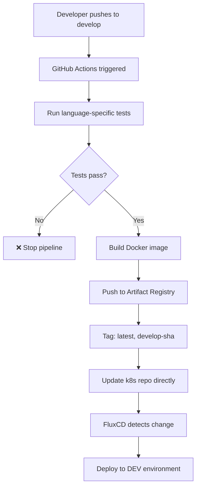
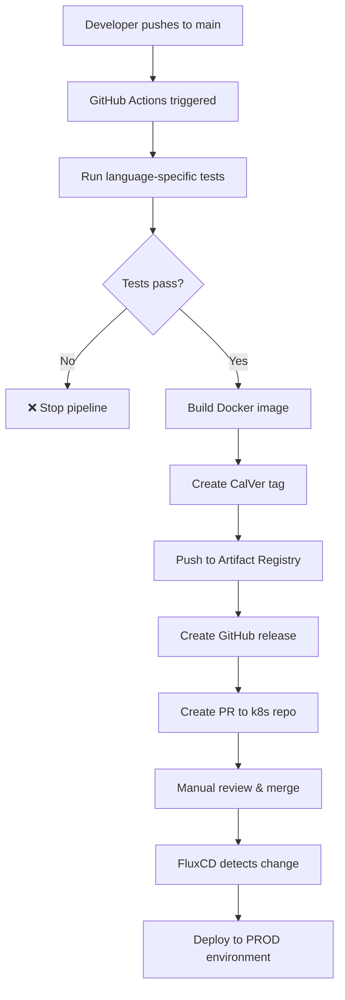

# Complete GitOps CI/CD Flow

This document shows the end-to-end CI/CD and GitOps flow we've implemented for the BBApp microservices.

## Architecture Overview

```
┌─────────────────┐    ┌─────────────────┐    ┌─────────────────┐
│   Microservice  │    │  Workflow Template │    │   K8s Repository │
│   Repository    │    │   Repository      │    │                 │
│  (admin-ui)     │    │                   │    │                 │
└─────────────────┘    └─────────────────┘    └─────────────────┘
         │                        │                        │
         ▼                        ▼                        ▼
┌─────────────────┐    ┌─────────────────┐    ┌─────────────────┐
│  GitHub Actions │◄───│ Reusable        │───►│ Kustomize       │
│  CI/CD Pipeline │    │ Workflows       │    │ Manifests       │
└─────────────────┘    └─────────────────┘    └─────────────────┘
         │                                              │
         ▼                                              ▼
┌─────────────────┐                          ┌─────────────────┐
│ Google Artifact │                          │    FluxCD       │
│    Registry     │                          │   (Watches)     │
└─────────────────┘                          └─────────────────┘
         │                                              │
         ▼                                              ▼
┌─────────────────┐                          ┌─────────────────┐
│ Container Image │                          │ GKE Cluster     │
│   (Tagged)      │◄─────────────────────────│ (Auto Deploy)  │
└─────────────────┘                          └─────────────────┘
```

## Complete Flow

### 1. Development Flow (develop branch)



### 2. Production Flow (main branch)



## Implementation Components

### 1. Microservice Repository (admin-ui)

**Files:**
- `.github/workflows/development.yml` - Development pipeline
- `.github/workflows/release.yml` - Production pipeline
- `Dockerfile` - Container build instructions

**Workflow Structure:**
```yaml
jobs:
  test:      # Language-specific testing
  build:     # Docker build & push  
  update-manifests: # GitOps manifest update
```

### 2. Workflow Template Repository

**Reusable Workflows:**
- `nodejs-test.yml` - Node.js testing template
- `golang-test.yml` - Go testing template  
- `python-test.yml` - Python testing template
- `development-build.yml` - Docker build for development
- `release-build.yml` - Docker build for releases
- `gitops-update.yml` - Kubernetes manifest updates

### 3. K8s Repository Structure

```
k8s/
├── base/
│   ├── admin-ui/
│   │   ├── deployment.yaml
│   │   ├── service.yaml
│   │   └── kustomization.yaml
│   └── user-service/...
├── overlays/
│   ├── dev/
│   │   └── kustomization.yaml
│   ├── staging/
│   │   └── kustomization.yaml
│   └── prod/
│       └── kustomization.yaml
```

### 4. FluxCD Configuration

FluxCD watches the k8s repository and automatically:
- Detects changes in overlay directories
- Applies updated manifests to appropriate environments
- Only deploys services with changed image tags

## Key Features

### ✅ Language-Agnostic
- Separate test templates for Node.js, Go, Python
- Docker-focused build process
- Supports any language with Dockerfile

### ✅ Selective Deployment
- Only changed services get deployed
- Environment-specific configurations
- Different deployment strategies per environment

### ✅ Security & Compliance
- Workload Identity Federation (keyless authentication)
- No shared secrets between environments
- Audit trail through Git history

### ✅ Developer Experience
- Simple workflow copying from examples
- Real working examples (admin-ui, user-service)
- Clear error messages and validation

### ✅ Production Ready
- CalVer versioning for releases
- Manual approval for production (PR-based)
- Automatic development deployments
- Image digest tracking for security

## Repository Setup

### Required Variables (GitHub Repository Settings)
- `GCP_PROJECT_ID` - Google Cloud project ID

### Required Secrets (GitHub Repository Settings)
- `GCP_WORKLOAD_IDENTITY_PROVIDER` - WIF provider
- `GCP_SERVICE_ACCOUNT` - Service account email
- `K8S_REPO_TOKEN` - GitHub token for k8s repository access

### Development Environment Configuration
- **Auto-deploy**: Direct commits to k8s repo
- **Image tags**: `latest`, `develop-<sha>`
- **Fast feedback**: Immediate deployment after build

### Production Environment Configuration  
- **Manual approval**: PR creation for k8s repo
- **Image tags**: CalVer format (YY.MM.PATCH)
- **Safe deployment**: Review process before production

## Benefits

1. **Eliminates Manual Builds**: Fully automated CI/CD pipeline
2. **Per-Service Image Tagging**: Each service has independent versioning
3. **Reusable Workflows**: No code duplication across microservices
4. **Language-Agnostic**: Supports multiple programming languages
5. **Selective Deployment**: Only changed services are deployed
6. **GitOps Best Practices**: Git as single source of truth
7. **Security**: Workload Identity Federation, no stored keys
8. **Scalability**: Easy to add new microservices

## Example Service Onboarding

To add a new microservice:

1. **Create new repository** with Dockerfile
2. **Copy workflow files** from admin-ui or examples
3. **Update test commands** for your language/framework
4. **Add k8s manifests** to k8s repository
5. **Configure repository secrets** and variables
6. **Push to develop** → Automatic deployment!

The entire process takes ~10 minutes per new service.

## Future Enhancements

- **Multi-cluster support**: Deploy to multiple GKE clusters
- **Advanced testing**: Integration tests, security scanning
- **Monitoring integration**: Automatic dashboards and alerts
- **Rollback automation**: Automatic rollback on deployment failures
- **Canary deployments**: Gradual rollout strategies
